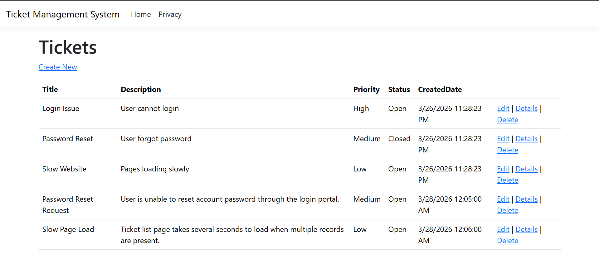
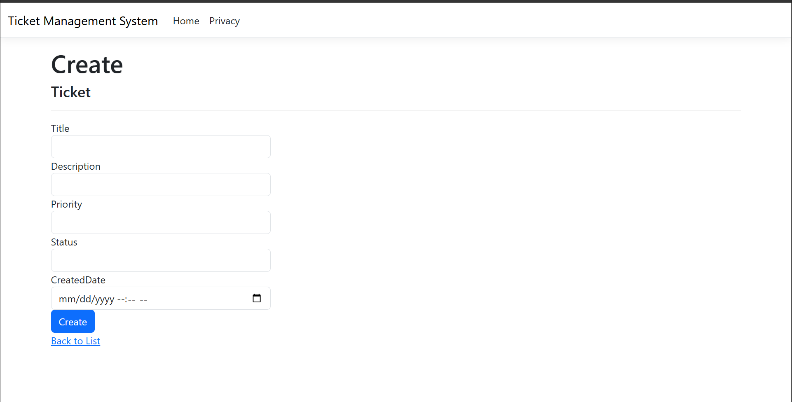
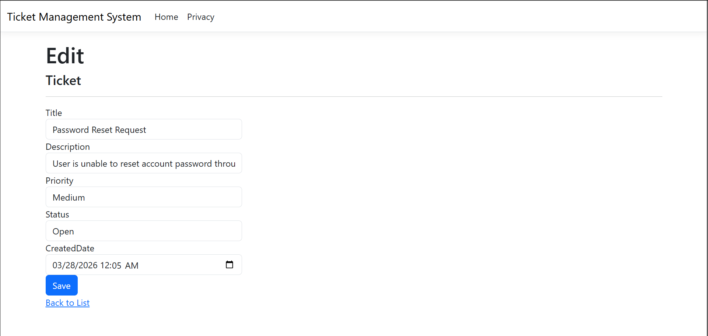
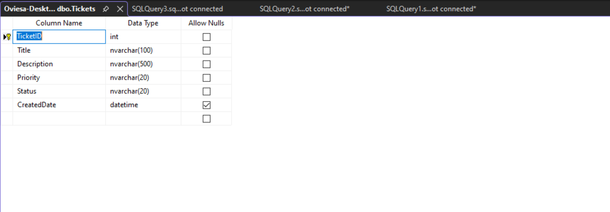
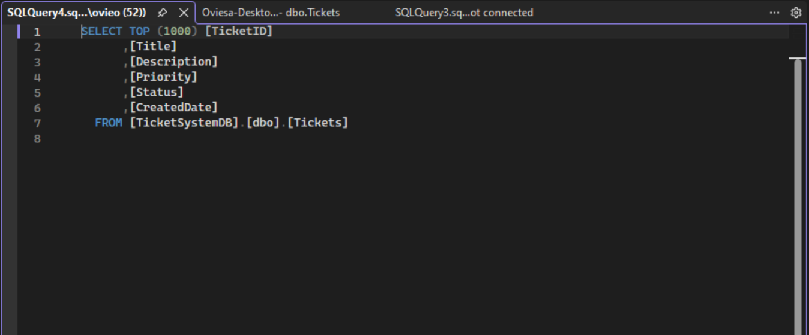

# SQL Server Web Application – Ticket Management System

## Project Overview

This project is a database-driven web application built using ASP.NET Core MVC and SQL Server. The application simulates a real-world support ticket workflow where users can create, view, update, and delete ticket records.

The purpose of this project is to demonstrate practical software engineering skills including database integration, CRUD operations, MVC architecture, and backend application development.

## Problem Statement

Many organizations require internal systems to track technical issues, support requests, and operational incidents. This project simulates a help desk ticket management system that allows structured tracking of requests and their resolution status.

## Technologies Used

Backend:
- C#
- ASP.NET Core MVC
- Entity Framework Core

Database:
- SQL Server Express
- SQL Server Management Studio (SSMS)

Frontend:
- HTML
- CSS
- Bootstrap
- Razor Views

Tools:
- Visual Studio
- GitHub

## Features

- Create new support tickets
- View all tickets in a structured table
- Edit ticket information
- Delete tickets
- Store ticket records in SQL Server
- MVC architecture implementation
- Database-driven UI rendering

## Application Architecture

This project follows the MVC (Model-View-Controller) architecture:

User Interface → Controller → Model → Database

Workflow:

User submits ticket  
↓  
Controller processes request  
↓  
Model interacts with SQL Server  
↓  
Data returned to View  
↓  
Results displayed to user  

## Database Schema

Main table used:

### Tickets Table

| Column | Type | Description |
|--------|------|-------------|
| TicketID | INT | Primary Key |
| Title | NVARCHAR | Ticket title |
| Description | NVARCHAR | Ticket details |
| Priority | NVARCHAR | Low / Medium / High |
| Status | NVARCHAR | Open / Closed |
| CreatedDate | DATETIME | Record creation date |

## Example Use Case

A user creates a support ticket describing an issue. The ticket is stored in SQL Server and displayed in the ticket list. The ticket can later be edited or deleted as needed.

## Project Structure

```text
sql-server-web-app
│
├── README.md
├── LICENSE
├── .gitignore
├── sql
│ ├── create-database.sql
│ └── seed-data.sql
│
├── screenshots
│ ├── 01-homepage.png
│ ├── 02-create-ticket.png
│ ├── 03-ticket-list.png
│ ├── 04-database.png
│ └── 05-query.png
│
├── docs
│ └── schema-diagram.png
│
└── TicketSystemWebApp
```

## Setup Instructions

### Prerequisites

Install:

Visual Studio Community  
SQL Server Express  
SQL Server Management Studio  

### Steps to Run

1. Clone repository

2. Create database using SQL scripts located in:

sql/create-database.sql

3. Insert sample data using:

sql/seed-data.sql

4. Update connection string inside:

appsettings.json

Example:


Server=(localdb)\MSSQLLocalDB;
Database=TicketSystemDB;
Trusted_Connection=True;


5. Run project from Visual Studio

6. Navigate to:

/Tickets

## Screenshots

### Ticket List


### Create Ticket Form


### Edit Ticket


### Database Table


### Query Results


### Schema Diagram


## Key Skills Demonstrated

Database design

SQL query development

ASP.NET MVC development

CRUD implementation

Backend integration

Software architecture fundamentals

Debugging database connectivity

Application development workflow

## Challenges Encountered

Connecting ASP.NET application to SQL Server

Understanding MVC workflow

Managing database schema changes

Configuring Entity Framework

## Lessons Learned

How MVC applications interact with databases

How CRUD operations function in production apps

Importance of database structure design

How backend and UI layers communicate

## Future Improvements

Add authentication system

Add user roles

Add ticket assignment

Add search functionality

Add dashboard analytics

Add REST API endpoints

Containerize application with Docker
